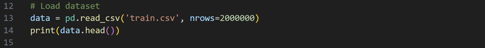
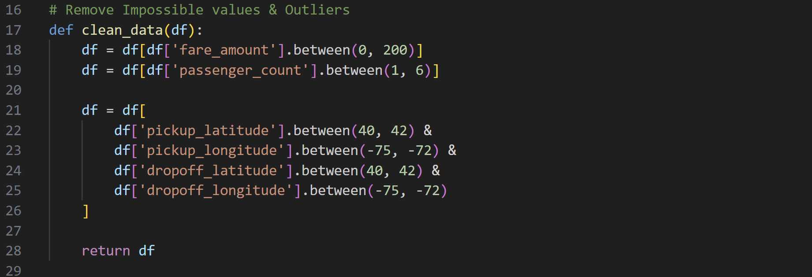
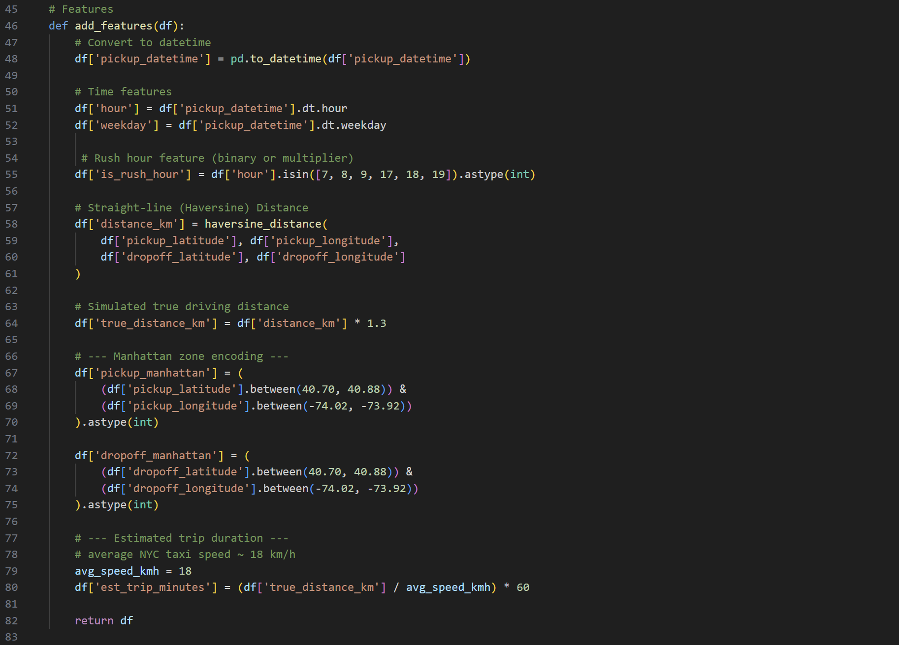
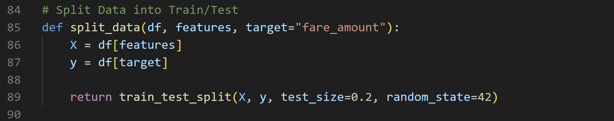
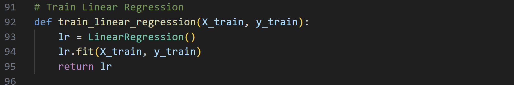
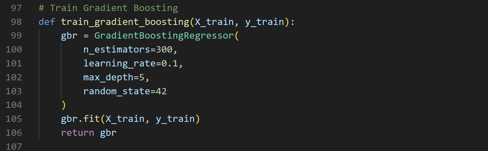
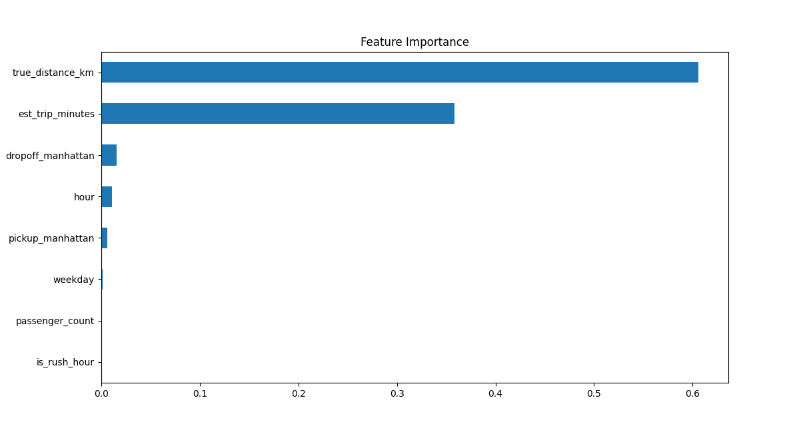
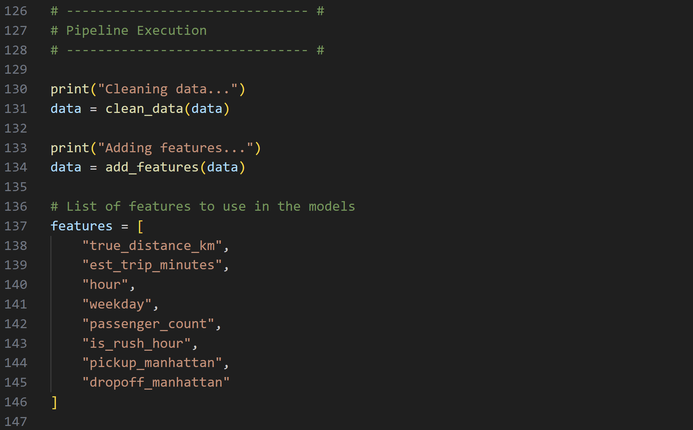
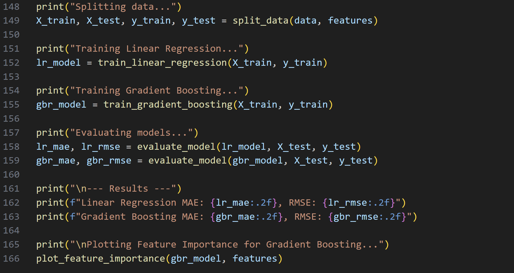

# NYC Taxi Fare Prediction: Linear Regression vs Gradient Boosting
This project builds a machine learning pipeline to predict NYC taxi fares using real-world trip data. 

The goal is to demonstrate feature engineering, model comparison, and production-style project structure.

# Results:
* Linear Regression MAE:	2.56, RMSE:	5.38
* Gradient Boosting	MAE:  2.22,	RMSE: 4.45	~17% improvement

Gradient Boosting performs significantly better, showing the value of non-linear modeling for geospatial data.

Data used: https://www.kaggle.com/competitions/new-york-city-taxi-fare-prediction/data?select=train.csv

Requirements:
  - pandas
  - numpy
  - scikit-learn
  - matplotlib
  - seaborn

Pipeline Overview:

1. Load Data

Reads 2,000,000 rows from the NYC taxi dataset.

2. Clean Data

Removes:

Impossible fares (≤0 or ≥$200)

Passenger count outliers

Latitude/longitude outside NYC

3. Feature Engineering

Adds:
- True Distance in KM derived from Haversine distance between pickup and dropoff
- Estimated trip minutes
- Hour of day
- Weekday
- Passenger count
- Rush hour or not
- Pickup/dpropoff location

4. Split Data into Train / Test:

5. Modeling

Two models are trained:

- Linear Regression

- Gradient Boosting Regressor

6. Evaluation

Metrics include:

Mean Absolute Error (MAE)

Root Mean Squared Error (RMSE)

Feature importance is visualized for GBR.

7. Pipeline Execution:
- Features

- Execution

